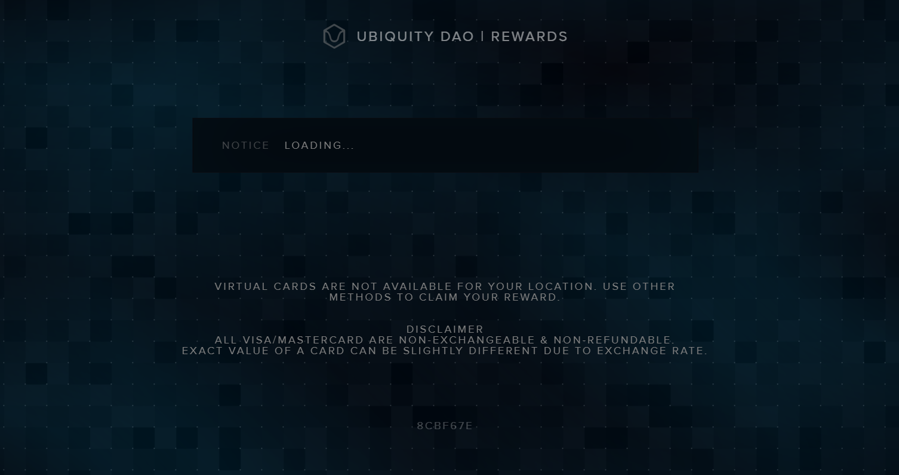

# Cash Out

## C**laiming Payment After Task Completion**

This section explains the process of claiming payment for completed tasks after your pull request is merged and the issue is marked as complete.

### **Step 1: Task Completion**

1. Ensure your **Pull Request (PR)** is merged by the repository maintainers.

<figure><figcaption></figcaption></figure>

2. Verify that the linked **GitHub Issue** is marked as **Completed**.

<figure><figcaption></figcaption></figure>

### **Step 2: Payment Link Generation**

Once the PR is merged and the issue is closed:

* The **bot** automatically generates custom **payment links** for every contributor to the task.
* These payment links are sent to each contributor based on the contribution details.

### **Step 3: Access Payment Links**

1. Open the communication platform or tool (e.g., GitHub comment, Notion dashboard) where the payment links are shared.
2. Look for the **bot notification** containing the payment link.

<figure><figcaption></figcaption></figure>

### **Step 4: Claim Your Payment**

<figure><figcaption></figcaption></figure>

1. Click on the payment link provided by the bot.
2. Follow the instructions on the Cash out Procedures page to claim your Reward.
