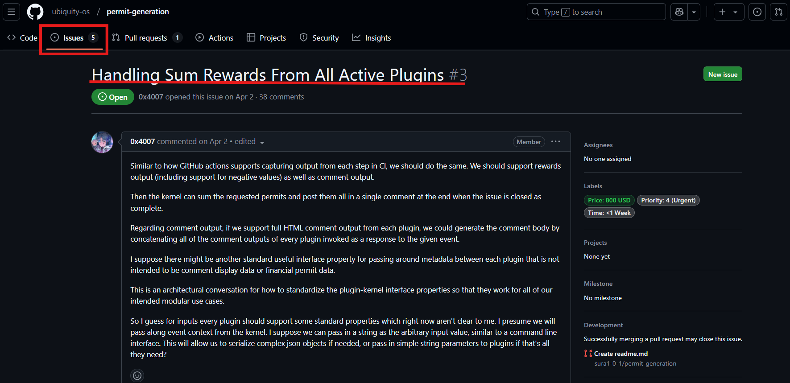

# Step by Step Onboarding

The **DevPool Flow** provides a step-by-step guide for new contributors to integrate into the DevPool and succeed as active members of the Ubiquity-OS ecosystem.

By following these steps, contributors can effectively engage with the DevPool.

### Step 1: Set Up Your GitHub Account

1.  **Sign Up**

    Visit  Official GitHub  Website and click on "**Sign Up**" if you don\`t have account or if you have already have a GitHub account click on "**Login**" to get stand with GitHub. Complete the registration form to create your account.
2.  **Verify Your Identity**

    Follow the prompts to verify your account. Secure your account with two-factor authentication.

Then, Go to the [DevPool directory](https://devpool.directory/) and log in with your GitHub account.

<figure><figcaption></figcaption></figure>

Next, GitHub prompts you to register for the DevPool.

<figure><figcaption></figcaption></figure>

Then, please provide the following details:

* **Username**: Enter your GitHub username.
* **Password**: Enter your GitHub password.

<figure><figcaption></figcaption></figure>

Finally, approve your registration by authorizing Ubiquity bot to access your GitHub credential\`s.

### Step 2: Start Contributing

* **Browse Available Tasks**

Browse Available Tasks for opportunities that match your skills. View task details, deadlines, Priority level and rewards.

* Sort tasks by **Price, Time, Priority,** or **Recent Activity**.
* Logging in with GitHub enables real-time text filtering by keyword.

<figure><figcaption></figcaption></figure>

Select a task that fits your skills and check out the issue in the GitHub UI.

### Step 3: Open Task and use Commands start working on the Task.

* Open Task that fit to your skill

<figure><figcaption></figcaption></figure>

Then, open the task.

<figure><figcaption></figcaption></figure>

* Use a list of **commands** to register and assign your self to the task.

use **/help** command to displays a list of all available commands and their descriptions.

<figure><figcaption></figcaption></figure>

These are all available commands

<figure><figcaption></figcaption></figure>

**1. /ask Command**

`/ask` Command to ask a question related to the repository, issue, or pull request.

**How to Use**

* Type `/ask` followed by your question.
* Be specific to get accurate answers.

`/ask How do I set up the development environment?`

**2. /Wallet Command**

Register your wallet address before completing any tasks. If this is your first time participating in the DevPool, you will need to register your wallet address to collect payment upon completion of the task.

**How to Use**

* Replace `ubq.eth` with your actual wallet address.

`/wallet mywallet.eth`

This must be done before you complete a task, because of the automatic payment system.

Comment “/wallet 0x0000” but with your address instead, on the issue you are interested to work on to register

3. **/start command**

Assign yourself and/or others to an issue or task.

#### **How to Use**

Type `/start` in the issue/task thread.

`/start`

You will be assigned to the issue or task.

4. /Stop Command

this command will Unassign yourself from an issue or task.

#### **How to Use**

Type `/stop` in the issue/task thread.

#### **Example**

#### `/stop`

this command will unassign you from the task or issue.

5. **/query Command**

Returns details about a user’s wallet, access level, and multiplier information.

#### **How to Use:**

1. Replace `@UbiquityOS` with the username whose information you want to query.

**Example:**

**`/query your username`**

6. **/allow** Command

Grants permission to a user to modify a specified label type.

#### **How to Use:**

1. Replace `@user1` with the username of the person you want to grant access.
2. Replace `label` with the specific label type.

#### **Example:**

**`/allow @JohnDoe bug`**
