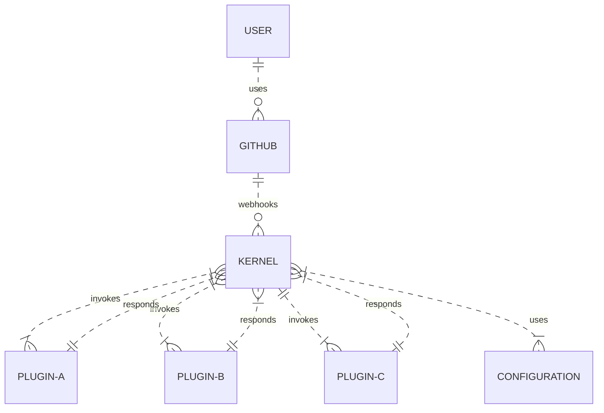

# Plugin-Development

### **Architecture Overview**


The Ubiquity architecture consists of a kernel and various plugins, each playing a crucial role in its functionality. The **kernel** is primarily responsible for forwarding events, originating from GitHub App webhooks, to the plugins specified in the **.ubiquity-os.config.yml** file. Additionally, it listens for the responses generated by these plugins after they have executed their designated tasks. The plugins serve to extend the capabilities of **Ubiquibot**; they are deployed as Cloudflare Workers or GitHub Actions. Each plugin is defined by a **manifest.json** file, which includes **metadata**, **inputs**, and **commands necessary** for its operation.

### What are Plugins

**Plugins** are at the heart of Ubiquibot’s extensibility, allowing developers to build custom functionalities that enhance automation, streamline workflows, and provide tailored solutions for various organizational needs. Plugin development revolves around leveraging the power of the Ubiquibot kernel to respond to GitHub events, execute commands, or handle complex tasks with precision and efficiency.&#x20;

Developing plugins for Ubiquibot opens the door to customizing and extending the platform to meet specific workflows and automation needs. This manual is designed to guide developers through the process of creating, testing, and deploying plugins seamlessly integrated with the Ubiquibot kernel.

### **Prerequisites**

**1,  Burner GitHub Organization**:

Set up a private repository (`.ubiquity-os`) to host your configurations.

Use this for **testing** and **showcasing** **QA** results.

**2, Cloudflare Accounts**:

* **Account 1**: Hosts the kernel.
* **Account 2**: Hosts all plugins (separate from kernel due to Cloudflare Worker restrictions).

**3, GitHub App Setup**:

The **webhook URL** must point to the kernel’s address.

This Guide provides a step-by-step guide for developers to create and deploy a plugin for the **Ubiquibot** **platform**. Follow these instructions to ensure your plugin integrates seamlessly with the Ubiquibot kernel.

### **File Structure**

Your `.ubiquity-os` repository should include:

```plaintext
.
├── .github
│   └── .ubiquity-os.config.yml
```

**Example Configuration (`.ubiquity-os.config.yml`):**

```yaml
plugins:
  - name: example-plugin
    id: example-plugin
    uses:
      - plugin: https://example-plugin.my-account.workers.dev
        with:
          inputKey: "inputValue"
```

## **Plugin Development**

### **Starter Kit**

Use the **Plugin SDK (upcoming)** and [boilerplate](https://github.com/ubiquity-os/plugin-template) from the plugin template. and this includes an entry point, utilities, and a simplified development setup.

### **Defining Plugin Capabilities**

Each plugin must include a `manifest.json` file:

```json
{
  "name": "example-plugin",
  "id": "example-plugin",
  "description": "An example plugin for demonstration.",
  "inputs": {
    "inputKey": {
      "type": "string",
      "description": "A configurable input for the plugin."
    }
  },
  "events": ["issues.opened", "pull_request.merged"]
}
```

## **Plugin Deployment**

### **Deploying to Cloudflare**

1. Ensure the plugin is hosted on a **different Cloudflare account** than the kernel.
2. Deploy the plugin using the provided GitHub Actions workflow.

### **Running Locally**

1. **With a locally hosted kernel**:
   *   Start the plugin server locally:

       ```bash
       yarn worker
       # or
       bun worker
       ```
   *   Reference the local plugin URL in `.ubiquity-os.config.yml`:

       ```yaml
       plugins:
         - uses:
           - plugin: http://localhost:4000
       ```
2. **With a hosted kernel**:
   *   Use **ngrok** to tunnel plugin traffic to your local machine:

       ```bash
       ngrok http 4000
       ```
   *   Update the configuration to use the ngrok URL:

       ```yaml
       plugins:
         - uses:
           - plugin: https://my-ngrok-url.ngrok-free.app
       ```

## **Testing Workflow**

### **Kernel Testing**

1. Trigger GitHub events (e.g., opening an issue).
2. Check logs and responses to ensure proper event handling and forwarding.

### **Plugin Testing**

* **Worker Plugins**:
  *   Test locally using a POST request:

      ```javascript
      javascriptCopy codeawait fetch("http://localhost:4000/", {
        method: "POST",
        headers: { "Content-Type": "application/json" },
        body: JSON.stringify({
          eventName: "issues.opened",
          eventPayload: {},
          settings: { inputKey: "inputValue" },
        }),
      });
      ```
* **Action Plugins**:
  * Simulate events in a repository where the kernel is configured.
  * Verify responses in GitHub Actions logs.

**Local Workflow with Nektos Act**

* Use Nektos Act to test GitHub Actions workflows locally.

***

## **Best Practices**

1. Keep your `.ubiquity-os` repository private.
2. Always use separate Cloudflare accounts for the kernel and plugins.
3. Use meaningful and descriptive names/IDs for plugins.
4. Document your plugins thoroughly in the `manifest.json` file.
